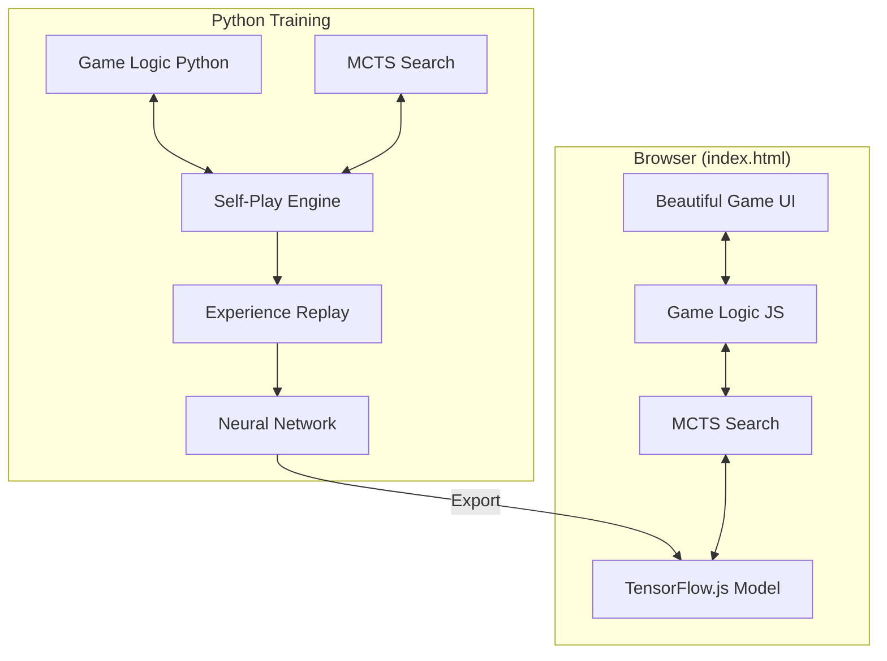

# AI-Powered Checkers Game – Implementation Plan

Build a beautiful, browser-based Checkers game with an AI opponent trained using reinforcement learning. The AI should be genuinely strong through self-play training using a neural network + MCTS hybrid approach (AlphaZero-lite).

---

## Architecture Overview



---

## Proposed Changes

### Component 1: Core Game Engine

#### [NEW] [checkers_game.py](file:///Users/alp/Desktop/Hobby%20Projects/rl-checkers/training/checkers_game.py)
Python implementation of checkers rules:
- 8×8 board representation as numpy array
- Piece types: EMPTY=0, BLACK=1, WHITE=2, BLACK_KING=3, WHITE_KING=4
- Move generation with mandatory captures
- Multi-jump chain capture logic
- King promotion on back row
- Win/draw detection (capture all pieces or block opponent)
- Board state hashing for MCTS

#### [NEW] [game.js](file:///Users/alp/Desktop/Hobby%20Projects/rl-checkers/js/game.js)
JavaScript port of game logic for browser:
- Identical rules implementation
- Move validation and legal move generation
- State management for UI integration

---

### Component 2: Neural Network

#### [NEW] [model.py](file:///Users/alp/Desktop/Hobby%20Projects/rl-checkers/training/model.py)
AlphaZero-style dual-head neural network:
- **Input**: 8×8×4 tensor (one-hot planes for piece types from current player's perspective)
- **Architecture**: 
  - 6 residual blocks with 128 filters
  - Batch normalization + ReLU activation
- **Policy head**: Outputs move probabilities over all possible moves (~200 max)
- **Value head**: Outputs win probability [-1, 1]
- Export to TensorFlow.js format

---

### Component 3: MCTS + Self-Play Training

# Multipocessing Training Plan

## Goal
Utilization of all 4 vCPUs on the VM to speed up MCTS self-play generation by 3-4x. Currently limiting factor is single-core Python performance.

## Design
Using `multiprocessing` to spawn independent worker processes for self-play.

### 1. `InferenceServer` (Main Process)
- Initializes the TensorFlow/Keras model on GPU.
- Listens on a `multiprocessing.Queue` (`prediction_queue`).
- Collects requests until `batch_size` is reached or small timeout (e.g. 0.01s).
- Run `model.predict_batch()`.
- Dispatches results to return Queues (one per worker) or a shared memory array.
- Using `SharedMemory` is faster but Queues are easier to implement correctly. For 8x8 checkers, tensors are small, so Queues are acceptable.

### 2. `SelfPlayWorker` (Child Processes x 3)
- Runs an independent loop of game generation.
- Manages local `CheckersGame` and `MCTS` tree.
- Instead of calling `network.predict`, it sends `(worker_id, board_tensors)` to `prediction_queue`.
- Waits for results on its own `result_queue`.
- Generates `TrainingExample`s and sends them to a `data_queue`.

### 3. `Trainer` (Main Process or Thread)
- Reads from `data_queue`.
- Saves to `ReplayBuffer`.
- Periodically trains the model on the buffer.
- Saves checkpoints.

## Code Changes

### [NEW] `training/mp_train.py`
New file to handle the multiprocessing logic. simpler than modifying `gcp_train.py` inline.

**Key Components:**
- `run_inference_server(model, input_queue, output_queues)`
- `run_worker(worker_id, input_queue, output_queue, data_queue, config)`
- `main()` orchestrator

### [MODIFY] `training/gcp_train.py`
Will basically be replaced or heavily modified to import from `mp_train`.

## Verification
1. **Local Test**: Run with 2 processes locally to verify IPC works and no deadlocks.
2. **VM Test**: Deploy to VM, verify `top` shows 400% CPU usage (4 cores utilized).
3. **Speed Check**: Measure games/min logic.

## Risk
- **Pickling Overhead**: If passing full game objects, it's slow. We only pass numpy arrays (batch, 8, 8, 4). This is fast.
- **Deadlocks**: Strict protocols on queue handling.
- **GPU Memory**: Multiple processes might try to initialize CUDA if not careful. **CRITICAL**: Only Main Process initializes TensorFlow. Workers must NOT import tensorflow or use it.

## File Structure
- `training/checkers_game.py` (Pure Python/Numpy - Safe for workers)
- `training/mcts.py` (Pure Python - Safe for workers)
- `training/mp_train.py` (Orchestrator) to TFJS format

---

### Component 4: Browser Game UI

#### [NEW] [index.html](file:///Users/alp/Desktop/Hobby%20Projects/rl-checkers/index.html)
Main game page structure:
- Game board container
- Move history panel
- Difficulty selector
- Theme toggle (dark/light)
- New game / restart controls

#### [NEW] [styles.css](file:///Users/alp/Desktop/Hobby%20Projects/rl-checkers/css/styles.css)
Beautiful, modern styling:
- CSS custom properties for theming
- Glassmorphism effects
- Smooth gradient backgrounds
- Responsive grid layout
- Piece styling with gradients and shadows

#### [NEW] [animations.css](file:///Users/alp/Desktop/Hobby%20Projects/rl-checkers/css/animations.css)
Smooth animations:
- Piece movement transitions
- Capture "pop" animations
- King promotion effects (crown appears)
- Legal move pulse highlights
- Board entry animations

#### [NEW] [ui.js](file:///Users/alp/Desktop/Hobby%20Projects/rl-checkers/js/ui.js)
UI controller:
- Board rendering with piece placement
- Drag-and-drop with visual feedback
- Click-to-select-then-click-to-move alternative
- Legal move highlighting on piece selection
- Move history updates
- Win/lose/draw modals

#### [NEW] [ai.js](file:///Users/alp/Desktop/Hobby%20Projects/rl-checkers/js/ai.js)
AI integration:
- Load TensorFlow.js model
- MCTS implementation in JavaScript
- Difficulty levels via MCTS simulation count:
  - Easy: 50 simulations
  - Medium: 200 simulations
  - Hard: 800 simulations
  - Impossible: 1600+ simulations
- Async move computation with "thinking" indicator

---

### Component 5: Model Weights

#### [NEW] [model/](file:///Users/alp/Desktop/Hobby%20Projects/rl-checkers/model/)
Directory containing:
- `model.json` – TensorFlow.js model architecture
- `group1-shard*.bin` – Model weights shards
- Pre-trained through self-play (~100k+ games)

---

## Training Strategy

### Phase 1: Initial Training (CPU-friendly)
- Train for 10,000 self-play games
- 100 MCTS simulations per move
- Learn basic tactics and piece capture

### Phase 2: Strengthening (GPU recommended)
- Train for 50,000+ additional games
- 400 MCTS simulations per move  
- Add opponent pool for diverse training
- Export checkpoint for browser testing

### Phase 3: Final Polish
- Train for 100,000+ total games
- Fine-tune learning rate
- Validate against minimax baseline
- Export final weights

---

## Difficulty Level Implementation

| Level | MCTS Sims | Behavior |
|-------|-----------|----------|
| Easy | 50 | Makes mistakes, beatable by beginners |
| Medium | 200 | Plays well, challenging for casual players |
| Hard | 800 | Very strong, requires skill to beat |
| Impossible | 1600 | Maximum strength, nearly unbeatable |

The difficulty is controlled by limiting MCTS simulation count. Lower counts = weaker play because the AI explores fewer possibilities.

---

## Verification Plan

### Automated Tests

1. **Python Game Logic Tests**
```bash
cd /Users/alp/Desktop/Hobby\ Projects/rl-checkers/training
python -m pytest test_game.py -v
```
Tests will verify:
- Legal move generation
- Mandatory capture enforcement
- Multi-jump chains
- King promotion
- Win detection

2. **Training Sanity Check**
```bash
cd /Users/alp/Desktop/Hobby\ Projects/rl-checkers/training
python train.py --test-mode --episodes=10
```
Validates training loop runs without errors.

### Manual Browser Testing

1. **Open the game**: Open `index.html` in Chrome/Firefox
2. **Visual check**: Verify board renders correctly with dark theme
3. **Make moves**: Click a piece → legal moves highlight → click destination
4. **Drag and drop**: Drag a piece to a valid square
5. **AI response**: After your move, AI should "think" then move
6. **Capture**: Set up a jump scenario → verify mandatory capture works
7. **Multi-jump**: Chain captures should auto-continue
8. **King promotion**: Move piece to back row → crown animation
9. **Difficulty**: Switch difficulties and observe AI speed/strength
10. **Theme toggle**: Switch between dark/light themes
11. **Move history**: Verify moves appear in log panel
12. **New game**: Reset button starts fresh game

### AI Strength Validation

Play 10 games at each difficulty level:
- Easy: Should be beatable by casual players
- Impossible: Should be very hard to beat

---

## File Structure

```
rl-checkers/
├── index.html              # Main game page
├── css/
│   ├── styles.css          # Core styling
│   └── animations.css      # Piece animations
├── js/
│   ├── game.js             # Game logic
│   ├── ui.js               # UI controller
│   └── ai.js               # AI + MCTS + TensorFlow.js
├── model/
│   ├── model.json          # TF.js model
│   └── *.bin               # Weight shards
└── training/
    ├── checkers_game.py    # Python game logic
    ├── model.py            # Neural network
    ├── mcts.py             # MCTS implementation
    ## Phase 3: Optimizing Training Speed
    - [x] Create `mp_train.py` for multiprocessing
        - [x] Implement `worker_process` for CPU-bound MCTS
        - [x] Implement `inference_server` for GPU-bound predictions
        - [x] Use `multiprocessing.Queue` for communication
        - [x] Fix `AttributeError` with custom `QueueMCTS`
        - [x] Optimize with 32 workers to saturate CPU
    - [x] Update `gcp_train.py` to use `mp_train.py` logic
    - [x] Deploy and Verify
        - [x] consistent ~100% CPU usage (load avg > 4) on 4 vCPUs.
        - [x] robustness against deadlocks.
        - [x] NOTE: System is CPU-bound. L4 GPU utilization is low (<5%) because 4 vCPUs cannot feed it fast enough. Throughput is maximized for this CPU config.
    
    ## Phase 3.5: Scaling Hardware (16-Core Upgrade)
    - [x] Upgrade VM to `g2-standard-16` (16 vCPUs, L4 GPU)
        - [x] Stop VM
        - [x] Resize
        - [x] Start VM
    - [x] Optimize Code for 16 Cores
        - [x] Update `gcp_train.py` to use 96 concurrent workers
        - [x] Update target to 50,000 games
    - [x] Restart Training
        - [x] Verify CPU saturation (16 cores)
        - [x] Verify higher GPU utilization
    ├── trainer.py          # Self-play training
    ├── train.py            # Main training script
    ├── test_game.py        # Unit tests
    └── requirements.txt    # Python dependencies
```

---

## Dependencies

### Python (training)
```
tensorflow>=2.10.0
numpy>=1.21.0
tensorflowjs>=4.0.0
pytest>=7.0.0
tqdm>=4.64.0
```

### Browser
- TensorFlow.js (loaded via CDN)
- No other external dependencies

---

## Estimated Timeline

| Phase | Duration | Deliverable |
|-------|----------|-------------|
| Game Engine | 2-3 hours | Python + JS game logic |
| Neural Network | 1-2 hours | Model architecture |
| Training Pipeline | 2-3 hours | Self-play + MCTS |
| Browser UI | 3-4 hours | Beautiful game interface |
| Initial Training | 4-8 hours | First playable AI |
| Strengthening | 12-24 hours | Strong AI weights |
| Polish & Testing | 2-3 hours | Final deliverable |

---

> [!IMPORTANT]
> **Training Time**: Achieving truly strong AI requires significant training time (12-24+ hours of self-play). I'll provide intermediate checkpoints so you can test gameplay while training continues.

> [!NOTE]
> **GPU Training**: For fastest results, training can be run on a GCP VM with GPU. The browser game works on CPU with the exported TensorFlow.js model.
