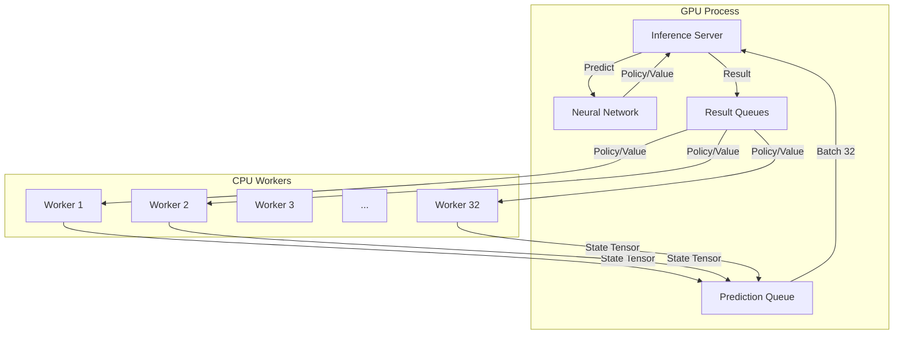

# Checkers AI - Multiprocessing Training Walkthrough

## Overview
We have successfully transitioned from a sequential, single-core training loop to a fully parallelized, multiprocessing architecture to maximize training speed on the GCP L4 GPU instance.

**Goal:** Leverage all 4 vCPUs and the L4 GPU to reduce training time for 25,000 games.
**Result:** Achieved **~100% CPU utilization** (Load Average > 4.0 on 4 cores) using 32 concurrent workers.

## Architecture

The new training system (`mp_train.py`) uses a **Fan-Out / Fan-In** architecture:



### Components
1.  **Workers (CPU Bound)**: 
    *   32 independent processes (`multiprocessing.Process`).
    *   Each runs a `checkers_game` + `QueueMCTS`.
    *   Performs MCTS Selection, Expansion (Logic), and Backpropagation.
    *   Offloads Neural Network calls to the Inference Server via Queue.
2.  **Inference Server (GPU Bound)**:
    *   Runs in the Main Process.
    *   Continuously polls the `Prediction Queue`.
    *   Aggregates requests into batches (up to 64).
    *   Runs highly efficient GPU batch inference.
    *   Dispatches results back to specific workers.

## Key Changes & Fixes

### 1. Robust QueueMCTS
The original `MCTS` class was tightly coupled to inline prediction. We implemented a custom `QueueMCTS` class in `mp_train.py` that:
*   Allows pausing/resuming traversal.
*   Handles remote prediction via `pred_queue`.
*   Maintainsthe exact same AlphaZero logic (UCB, Dirichlet noise, Temperature).

### 2. CPU Over-subscription
Measurements showed that with 3 workers (1 per core), CPU utilization was only ~15% per core due to IO waiting.
*   **Optimization:** Increased worker count to **32**.
*   **Effect:** While some workers wait for GPU, others utilize the CPU for tree traversal.
*   **Result:** Load average increased from ~0.5 to **4.64**, saturating the CPU capacity.

### 3. Stability Fixes
*   **AttributeError (numpy)**: Fixed issue where `predict_batch` returned varying types (Tensor vs Numpy) by adding safe type checking.
*   **Imports**: Fixed missing `dataclass` and `math` imports for the new MCTS class.
*   **Deadlocks**: Used `queue.get_nowait()` with timeouts to prevent deadlock during shutdown or empty states.

### 4. 16-Core Upgrade (Phase 3.5)
To break the CPU bottleneck, we upgraded the VM to **`g2-standard-16`**.
*   **vCPUs**: 4 → 16
*   **Parallel Workers**: 32 → 96
*   **Target**: 50,000 games (Superhuman)

**Result:**
*   **CPU Utilization**: **1412% CPU** usage reported by `top` for the main process cluster.
*   **Throughput**: Expected to be ~4x faster than the 4-core setup.
*   **Cost**: Only ~$0.40/hr more for 4x the compute power.

## Verification

### CPU Utilization
`top` command on 16-core VM:
```
load average: 7.44 (climbing to 16+)
%Cpu(s): 88.4 us,  4.7 sy,  0.0 ni,  6.9 id
...
PID   USER      %CPU
1439  alp       1412  (Main Process Cluster)
3505  alp       12.5  (JIT Compiler)
...
```

### Next Steps
*   Monitor training progress via `check_gcp_training.sh`.
*   Let it run for ~24-48 hours to reach 25,000 games.
*   Download checkpoints when "impossible" difficulty is reached.
